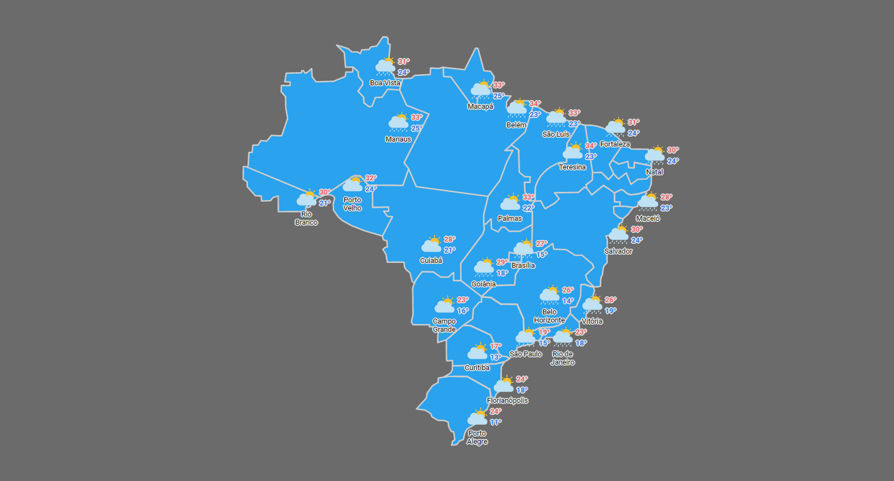
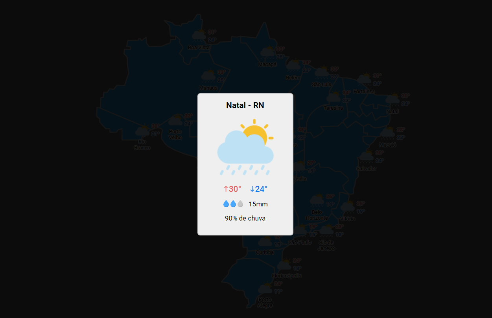

# Clima Brasil
- Projeto está em estágio inicial, ainda não está responsivo
- Utilizando webScrapping para pegar dados dos climas no brasil no site https://www.climatempo.com.br

# Funcionamento
- Ao carregar a página é feito a consulta de dados via webscrapping e atualização dos dados
- As capitais estão em suas respectivas localizações
- Ao clicar em uma das capitais é aberto um "card" sobre o clima dela

--- 

## Demonstração

---

# Linguagens utilizadas
- PHP
- JS e jQuery

---
## Contribuidores

- Raphael Satomi Gomes de Andrade <raphaelsatomi@gmail.com>
